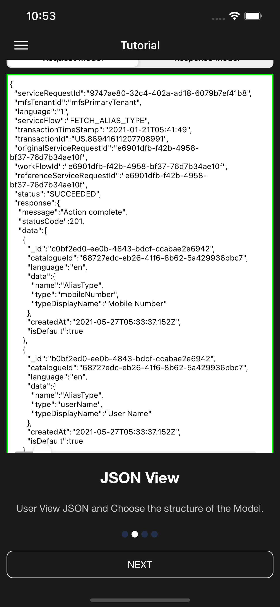
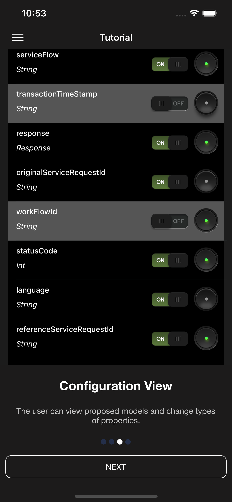
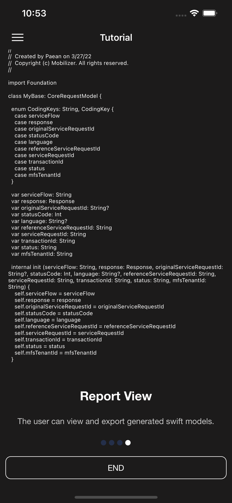

# Swiftly
Understand Your Json Better

What is swiftly?
swiftly  is a Swift model generator that Formats and generates models for the given JSON and also breaks them into files making it easy to manage and share between several models.
Features: 
* The models that are generated depend Swift’s inbuilt Codeable feature making encoding and decoding objects a thing of the past.
* Allows to opt for either optional or non-optional variables.
* Allows an array of a certain object type with different properties to be merged into a single model with all properties.
* Click Load folder with JSON files + Config to generate all possible models for given folder with JSON files, note this needs a .config.json as this uses the CLI logic internally.

## *App Screens*

Show up the option to request cheque book

Show up the option to enquire cheque book

Show up the option to cancel cheque book

